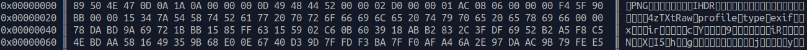

# Hexhibit

## Description

An hexadecimal dumper built from scratch with [Rust](https://www.rust-lang.org/).

Output example on a PNG file:

## Build & run

1. Clone this repository, and go to `hexhibit` folder
2. Compile with `cargo build --release`
3. Go to binary folder `cd ./target/release`
4. Run with `./hexhibit <a file>`
